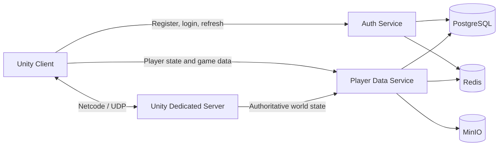

# Sea of Corsairs

Sea of Corsairs is a work-in-progress multiplayer naval action game built with Unity. Players explore a connected world of sea regions, control ships, fight NPCs and other threats, collect rewards, trade equipment, manage their fleet, and persist their progression through a containerized backend.

The project combines a Unity client and dedicated server with ASP.NET Core services for authentication and player data.


## Highlights

- Server-authoritative multiplayer gameplay using Unity Netcode for GameObjects
- Ship navigation, combat, target selection, cannons, ammunition, and harpoons
- NPC ships, sea monsters, island defenses, reward boxes, and spawn systems
- Multi-scene world map with regional travel and fog-of-war visibility
- Inventory, wallet, market, ship depot, guild, and island-building systems
- Runtime UI built primarily with Unity UI Toolkit
- Account registration, login, JWT authentication, and refresh-token rotation
- Persistent player state backed by PostgreSQL and Redis
- S3-compatible asset and log storage through MinIO
- Windows client and Linux headless-server build tooling

## Tech Stack

### Game

- Unity `6000.3.9f1`
- C#
- Universal Render Pipeline (URP) `17.3.0`
- Unity Netcode for GameObjects `2.10.0`
- Unity Input System `1.18.0`
- Unity UI Toolkit
- Addressables, AI Navigation, Cinemachine, VFX Graph, and PrimeTween

### Backend

- ASP.NET Core / .NET 6
- Entity Framework Core
- PostgreSQL 16
- Redis 7
- MinIO (S3-compatible object storage)
- Docker Compose

## Architecture



The Unity client uses `http://localhost:8081` for authentication and `http://localhost:8082` for player data by default. The dedicated server listens on UDP port `7777`.

## Project Structure

```text
SeaOfCorsairs/
├── Assets/
│   ├── Data/                 ScriptableObject-based game data
│   ├── Scenes/               Main scene and world-map regions
│   ├── Scripts/              Gameplay, networking, backend, and editor code
│   └── UI/Screens/           Runtime UI Toolkit screens
├── backend/src/
│   ├── SeaWars.AuthService/
│   ├── SeaWars.Backend.Common/
│   └── SeaWars.PlayerDataService/
├── docker/postgres/          Local database initialization
├── Builds/LinuxServerBuild/  Linux server Docker context
├── Packages/                 Unity package manifest and embedded packages
├── ProjectSettings/          Unity project configuration
└── docker-compose.yml        Local backend and game-server stack
```

## Requirements

- Unity Hub with Unity Editor `6000.3.9f1`
- Git
- Docker Desktop with Docker Compose
- .NET 6 SDK only if you want to run or modify the backend outside Docker
- Unity Linux Build Support for producing the containerized dedicated server

## Getting Started

### 1. Clone the repository

```powershell
git clone https://github.com/karaok1/SeaOfCorsairs.git
cd SeaOfCorsairs
```

### 2. Start the local backend

The following command starts PostgreSQL, Redis, MinIO, and both ASP.NET Core APIs without requiring a prebuilt Unity server:

```powershell
docker compose up --build auth-service player-data-service
```

Once the services are ready, verify them at:

- Auth health: `http://localhost:8081/health`
- Player Data health: `http://localhost:8082/health`
- Auth Swagger: `http://localhost:8081/swagger`
- Player Data Swagger: `http://localhost:8082/swagger`
- MinIO console: `http://localhost:9001`

The Compose file contains development defaults. Set `JWT_SIGNING_KEY`, `SEAWARS_SERVER_API_KEY`, `MINIO_ROOT_USER`, and `MINIO_ROOT_PASSWORD` in a root-level `.env` file before using the stack outside local development.

### 3. Open the Unity project

1. Add the repository folder to Unity Hub.
2. Open it with Unity `6000.3.9f1`.
3. Allow Unity to restore the packages listed in `Packages/manifest.json`.
4. Open `Assets/Scenes/MainScene.unity`.
5. Enter Play Mode and use the login overlay to connect to the local services.

`MainScene` and all world-map region scenes are already enabled in Build Settings.

## Local Multiplayer

The repository includes ParrelSync and Unity Multiplayer Play Mode for local multiplayer workflows. You can run cloned editor instances or combine one editor client with standalone builds when testing multiple players.

Default local endpoints:

| Component | Address |
| --- | --- |
| Game server | `127.0.0.1:7777/udp` |
| Auth API | `http://localhost:8081` |
| Player Data API | `http://localhost:8082` |
| PostgreSQL | `localhost:5432` |
| Redis | `localhost:6379` |
| MinIO API | `http://localhost:9000` |

## Builds

### Windows client

In the Unity Editor, select:

```text
Tools > Build Windows Client
```

The build is written to `Builds/Windows/SeaOfCorsairs.exe`.

### Linux dedicated server

Install Unity's Linux build support, then select:

```text
Tools > Build Linux Server Headless
```

The server is written to `Builds/LinuxServerBuild/`. After the build succeeds, start the complete stack:

```powershell
docker compose up --build
```

## Backend Capabilities

The local APIs currently support:

- Account registration, login, logout, token refresh, and authenticated identity
- Versioned player-state persistence with optimistic concurrency
- Wallet, item, cannon, ship, and ritual transactions
- Guild listing and creation
- Server-managed persistent world objects
- Presigned MinIO URLs for asset downloads and log uploads

See [`backend/README.md`](backend/README.md) for API details and migration commands.

## World Map Tools

The project includes custom editor tooling for authoring and validating the multi-scene world map:

```text
Tools > World Map > Map Editor
```

See [`docs/world-map-editor-workflow.md`](docs/world-map-editor-workflow.md) for the authoring workflow.

## Project Status

Sea of Corsairs is under active development. APIs, gameplay balance, content, scenes, and tooling may change while core systems are being expanded and stabilized.

## Author

Developed by [Abdullah Akçam](https://github.com/karaok1).


